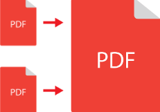
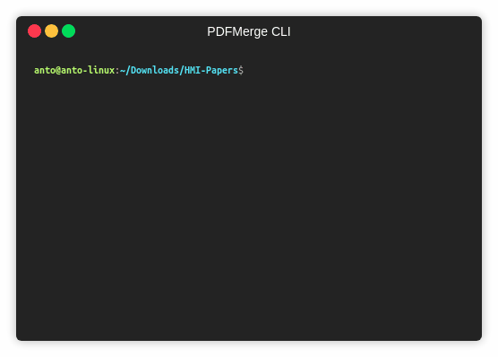

<div align="center">

<h1>PDFMerge CLI</h1>
<p>
A simple CLI tool for quickly merging PDF files.
</p>


</div>  

# Installation  
```
npm i -g pdfmerge-cli
```

# Usage  
1. Open Command Prompt and go to the directory containing the PDF files to be merged.

2. Type `pdfmerge` and hit Enter.

3. The interface will ask you the number of files to be merged. Type the number and press Enter. *Note: You can skip this step by just pressing Enter. The default number of files to be merged will be taken as 2*.

4. Now select the files by navigating with the help of Up and Down arrow keys and press Enter to select the particular file from the list. 

5. After all files have been selected, the interface will ask the name for destination (merged) file. Type the name of your choice and press Enter. *Note: You can skip this step by just pressing Enter. The default destination file name will be taken as merged.pdf*.

6. You have your merged PDF ready in the current directory !!!

# Demo  
  

# Credits
PDFMerge CLI uses [easy-pdf-merge](https://github.com/karuppiah7890/easy-pdf-merge) for merging the files.
